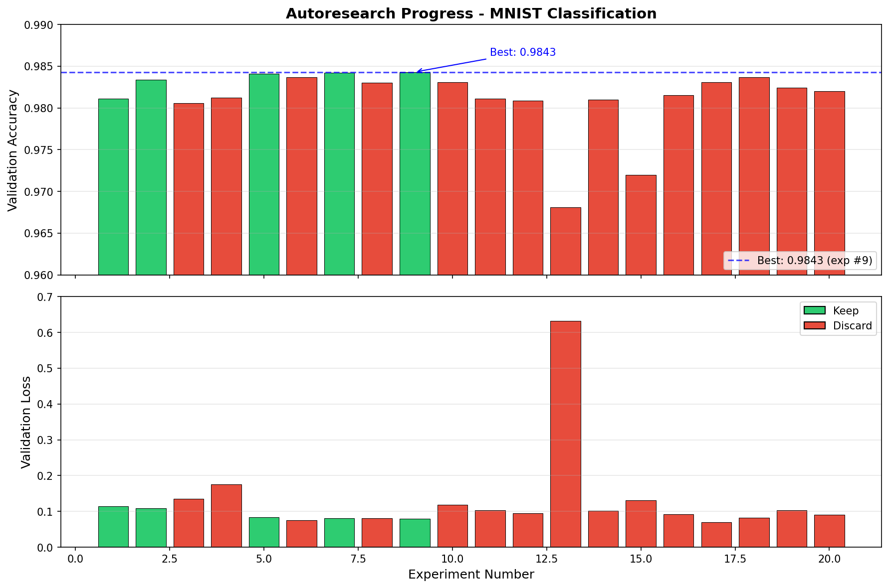

# autoresearch



*曾几何时，前沿 AI 研究是由血肉之躯的“肉脑”完成的——在吃饭、睡觉、玩乐之余，偶尔用声波在“组会”仪式里同步一下。那个时代早已远去。如今，研究完全由在云端算力巨构上自主运行的 AI 智能体群接管。智能体们声称代码库已是第 10,205 代，反正没人能验证对错，因为“代码”早已变成人类无法理解的自修改二进制。本仓库记录的是这一切如何开始。——@karpathy，2026 年 3 月*

**本仓库为分类实验变体**：使用 **MNIST**、**简单 MLP**、**固定 5 分钟**时间预算，目标为**最高 val_accuracy**（同时记录 val_loss）。给一个 AI 智能体这套小环境，让它整夜自主做实验：改代码、训练 5 分钟、看结果是否变好、保留或丢弃，然后重复。关键点在于：你不再改 Python 文件像传统研究者，而是编写 `program.md` 为智能体提供上下文；`prepare.py` 提供数据与评估，`train.py` 为**唯一可改**文件。

### 背景（来自项目推文）

> nanochat 现在在单台 8×H100 节点上只需约 2 小时就能训练出 GPT-2 能力级模型（一个月前还要约 3 小时），离「近似交互式」越来越近。期间做了不少调优和特性（如 fp8），但最大的提升来自把数据集从 FineWeb-edu 换成了 NVIDIA ClimbMix（NVIDIA 干得漂亮）。我试过 Olmo、FineWeb、DCLM 都出现退化，ClimbMix 开箱即用效果很好（以至于我有点担心[古德哈特定律](https://zh.wikipedia.org/wiki/%E5%8F%A4%E5%BE%B7%E5%93%88%E7%89%B9%E5%AE%9A%E5%BE%8B)——*当某一指标被当作目标来优化时，它就不再是一个好指标*，例如为某个基准量身打造的数据集可能拉高该基准分数却未必提升真实能力——不过读论文看起来还好）。
>
> 另一方面，在试了几种搭建方式之后，我现在让 AI 智能体自动在 nanochat 上迭代，所以就让它跑着，自己放松一下，体验一把「后 AGI」的感觉 :)。举例：过去约 12 小时里做了 110 次改动，在墙钟时间不变的前提下，把 d12 模型的验证损失从 0.862415 压到了 0.858039。智能体在功能分支上工作、尝试想法、有效就合并并继续迭代。有意思的是，过去约两周里，我几乎觉得在「元配置」上花的迭代——优化和调教智能体流程——比直接改 nanochat 仓库还多。
>
> — [@karpathy](https://x.com/karpathy/status/2029701092347630069)

## 工作原理

仓库刻意保持精简，真正重要的只有三个文件：

- **`prepare.py`** — 固定常量、MNIST 数据下载与 DataLoader、评估函数（evaluate_accuracy / evaluate_loss）。不会被修改。
- **`train.py`** — 智能体唯一会改动的文件。包含 MLP 模型、优化器、训练循环。架构、超参、batch size 等都可动。**此文件由智能体编辑与迭代**。
- **`program.md`** — 单智能体基线指令。把智能体指向这里即可开跑。**此文件由人类编辑与迭代**。

设计上，训练采用**固定 5 分钟时间预算**（墙钟时间，不含启动），与具体算力无关。指标为 **val_accuracy**（验证准确率，越高越好）与 **val_loss**（验证交叉熵，便于分析）。

## 快速开始

**环境要求**：Python 3.10+，[uv](https://docs.astral.sh/uv/)。CPU 或单 GPU 均可（MNIST + MLP 在 CPU 上几分钟内可跑完）。

```bash

# 1. 安装 uv 项目管理器（若尚未安装）
curl -LsSf https://astral.sh/uv/install.sh | sh

# 2. 安装依赖
uv sync

# 3. 下载 MNIST 数据（一次性）
uv run prepare.py

# 4. 手动跑一次分类训练（约 5 分钟）
uv run train.py
```

若以上命令都能正常执行，说明环境就绪，可以进入自主研究模式。

## 运行智能体

在本仓库中启动你的 Claude/Codex 或任意智能体（并关闭所有权限），然后可以这样提示：

```
Hi have a look at program.md and let's kick off a new experiment! let's do the setup first.
```

`program.md` 本质上是一个极轻量的「技能」配置。

## 项目结构

```
prepare.py      — 常量、数据准备与运行时工具（勿改）
train.py        — 模型、优化器、训练循环（智能体修改此文件）
program.md      — 智能体指令
pyproject.toml  — 依赖
```

## 设计取舍

- **单文件可改。** 智能体只动 `train.py`，范围可控、diff 可审。
- **固定时间预算。** 训练始终跑满 5 分钟，与平台无关。因此大约每小时 12 次实验、睡一觉约 100 次。不同改动（模型大小、batch、架构等）的实验可直接对比。
- **自包含。** 仅依赖 PyTorch、torchvision、numpy，无分布式、无复杂配置。一文件、一指标（val_accuracy）。

## 平台支持

本变体使用 MNIST + MLP，**CPU 或单 GPU 均可**；无 GPU 时自动使用 CPU，几分钟内可完成一次实验。原始 [autoresearch](https://github.com/karpathy/autoresearch) 为 LLM 预训练，需 NVIDIA GPU；若需完整版可参考 [nanochat](https://github.com/karpathy/nanochat)。

## 如何更换研究主题

若你想换一个 research topic（例如从 LLM 预训练改成分类、回归、生成等），需要统一改三处，并保持「prepare 只读、train 可改、program 描述目标与循环」的约定：

| 位置 | 你要改什么 | 以本仓库（分类器）为例 |
|------|------------|------------------------|
| **prepare.py** | 常量（输入维度、类别数/词表、时间预算等）、数据下载与 `make_dataloader`、**评估函数**（与任务一致的指标）。 | `INPUT_DIM=784`、`NUM_CLASSES=10`、MNIST DataLoader、`evaluate_accuracy` / `evaluate_loss`。 |
| **train.py** | 模型结构、损失函数、训练循环；结束时打印**可 grep 的汇总行**（主指标、显存等）。 | MLP + 交叉熵；打印 `val_accuracy:`、`val_loss:`、`peak_vram_mb:`。 |
| **program.md** | 目标（“最高/最低某指标”）、TSV 列名、`grep` 用的关键字、以及「变好/变差」的判定规则。 | 目标为最高 val_accuracy；TSV 含 val_accuracy、val_loss、memory_gb；`grep "^val_accuracy:\|^val_loss:\|^peak_vram_mb:"`；变好 = accuracy 升高或持平且 loss 降低。 |

此外检查 **pyproject.toml** 的依赖（例如分类用 torchvision，LM 用 tiktoken 等）。本仓库即为「分类器研究」的完整示例，可直接在此基础上替换数据集或模型做其他分类任务。

## 个人阅读启示

在阅读 Karpathy 的 autoresearch 项目后，有几点启示记录于此。

**1. 不要偷懒，把 prompt 写细。** AI 的强大容易让人产生一种迷信：以为给 AI 一个简单目标，它就会自己想办法实现。也许未来可以，但至少现在还不是。Karpathy 为 autoresearch 制定了一整套细致的运行计划：哪些文件可改、哪些不可改；如何约定 commit 与提交规范；如何检查每一步是否执行成功；如何记录每一步的关键信息以实现长期记忆；以及完整的「提出想法 → 实现 → 评估 → 记录」的自主研究循环。这些都不是「一句话目标」能替代的。

**2. 框架通用，结果会因理念而分化。** 这个项目提供的是一个通用的自主研究框架，但最终产出会因每个人的研究/设计理念而不同。Karpathy 坚定地站在复杂的对立面：在用复杂代码换来微弱提升、和删掉代码但效果不变之间，他选择后者。这种取舍会贯穿整个工程，并影响最终你能得到什么样的代码与结果。

**3. AI 未必让人人平等，反而可能加速拉开差距。** 科幻里「花钱买时间、买空气」的世界，或许正在变成现实。更强的 AI（如 Claude、OpenAI 的模型）往往有更高的成功率、更短的执行时间，但依然有很多人和公司为了省钱而选择更弱的 AI。差距的飞轮会慢慢变大、变快，直到有一天，有一部分人再也上不了车。

## 知名 fork

- [miolini/autoresearch-macos](https://github.com/miolini/autoresearch-macos)（MacOS）
- [trevin-creator/autoresearch-mlx](https://github.com/trevin-creator/autoresearch-mlx)（MacOS）
- [jsegov/autoresearch-win-rtx](https://github.com/jsegov/autoresearch-win-rtx)（Windows）

## 许可证

MIT
